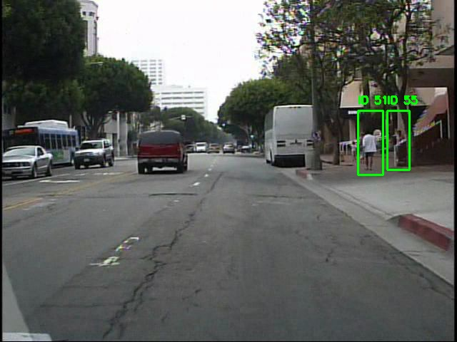

# Sistem de urmarire a obiectelor (bazat pe CNN)
Pentru a realiza proiectul s-a ales urmarirea persoanelor in secvente video. Rezultatul final este un videoclip in care persoanele sunt incadrate in bounding box-uri si au deasupra cate un ID. Aceast ID identifica in mod unic acea persoana si astfel se realizeaza urmarirea.

S-a folosit baza de date Caltech Pedestrians care poate fi acesate de aici https://data.caltech.edu/records/f6rph-90m20. Aceasta baza de date se constituie din sevente video in format `.seq` si etichete in formatul `.vbb`.

Proiectul folosete doi algoritmi pentru a realiza intai detectia, iar apoi identificarea persoanelor. Primul este reteau neurala `YOLOv5n` folosita pentru detectia persoanelor, iar al doilea este algoritmul `DeepSORT` care identifica persoanele.
`DeepSORT` foloseste si o retea `CNN` pentru a extrage trasaturi prin care persoana poate fi reidentificata chiar daca lipseste pentru putin timp din cadrul video sau daca reteau `YOLOv5n` nu reuseste sa identifice acea persoana in fiecare cadru.

Cei doi algoritmi se gasesc la adresele https://github.com/ultralytics/yolov5 `YOLOv5`, respectiv https://github.com/nwojke/deep_sort?tab=readme-ov-file `DeepSORT`.

# Instalare
Dupa ce se downloadeaza cele trei resurse, acestea trebuiesc modificate. Se vor inlocui sau adauga fisierele din `fisiere_modificate_DeepSORT`, respectiv `fisiere_modificate_YOLO` in locul celor originale.
Modificarile pentru `DeepSORT` sunt necesare datorita faptului ca acesta functioneaza cu `tensorflow 1.x` si deci cu o versiune de python incompatibila cu proiectul `YOLOv5`.
De asemenea, in `linear_assignment.py` s-a inlocui functia `linear_assignment` din `sklearn.utils.linear_assignment_` cu functia `linear_sum_assignment` din `scipy.optimize`.

La proiectul `YOLOv5` se adauga intai fisierul YAML `CaltechPedestrian.yaml` folosit pentru antrenare. Si se adauga si continutul folderului `runs`. Acesta contine informatiile generate dupa antrenare, cat si ponderile salvate in fisierul `best.pt` dupa ce s-a antrenat pe baza de date `Caltech Pedestrians`.

Este posibil sa existe si alte incompatibilitati pe care am uitat sa le mentionez.

# Baza de date
Baza de date trebuie organizata in felul urmator folosind fisierul `Dataloader.ipynb`.
```
dataset
  ├── images
  |     ├── test
  |     |     ├── set09_V000_0.jpg
  |     |     ├── set09_V000_1.jpg
  |     |     ├── set09_V000_2.jpg
  |     |     |         ...
  |     |
  |     ├── train
  |     |     ├── set00_V000_0.jpg
  |     |     ├── set00_V000_1.jpg
  |     |     ├── set00_V000_2.jpg
  |     |     |         ...
  |     |
  |     └── val
  |           ├── set06_V000_0.jpg
  |           ├── set06_V000_1.jpg
  |           ├── set06_V000_2.jpg
  |           |         ...
  |
  └── labels
        ├── test
        |     ├── set09_V000_0.txt
        |     ├── set09_V000_1.txt
        |     ├── set09_V000_2.txt
        |     |         ...
        |
        ├── train
        |     ├── set00_V000_0.txt
        |     ├── set00_V000_1.txt
        |     ├── set00_V000_2.txt
        |     |         ...
        |
        └── val
              ├── set06_V000_0.txt
              ├── set06_V000_1.txt
              ├── set06_V000_2.txt
              |         ...
```

# Antrenare
Antrenarea si testarea se pot face folosind scriptul `antrenare-YOLOv5n.ipynb` sau cu comenzile:

```
python train.py --device 0 --data CaltechPedestrian.yaml --epochs 1 --weights '' --cfg yolov5n.yaml --batch-size 10
python detect.py --weights runs/train/exp/weights/best.pt --source ../dataset/images/test --device 0
```

# Rezultate



